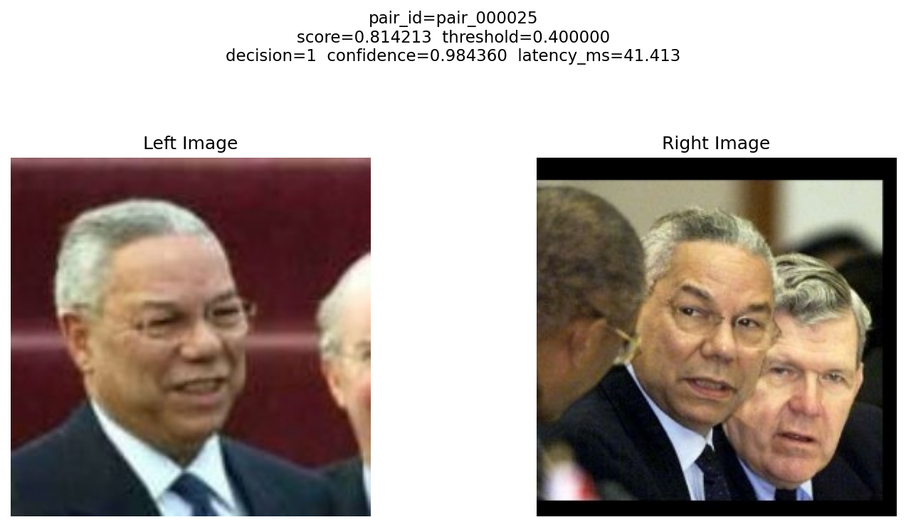
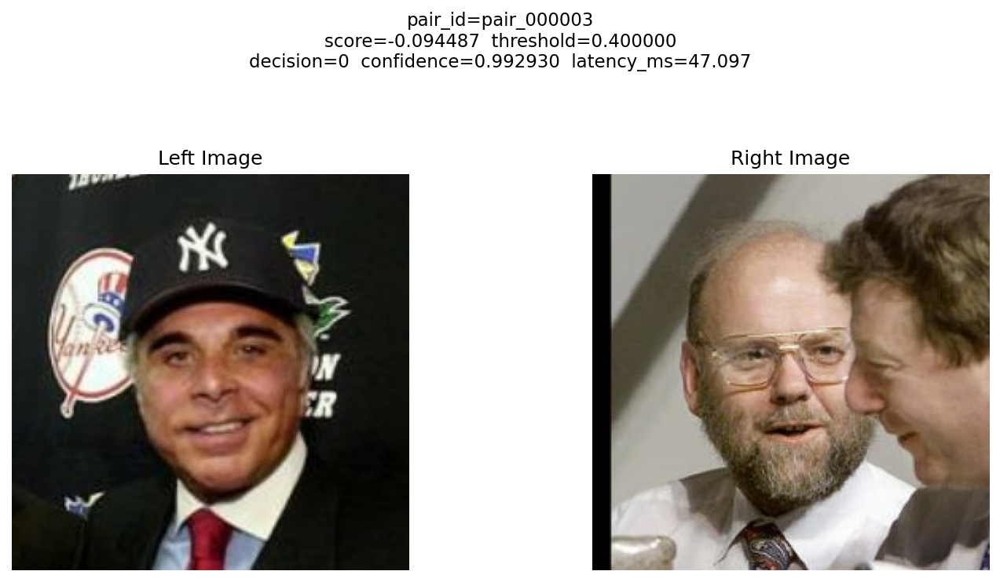

# FaceID_Verification System

> Compare two faces, score the match, explain the decision, and ship it with reproducible evaluation artifacts.

| Same Identity Detected | Different Identity Rejected |
| --- | --- |
|  |  |
| High-confidence positive match with score, threshold, decision, and latency in one output. | High-confidence negative match showing the full side-by-side inference result. |

End-to-end face verification pipeline with deterministic data preparation, tracked evaluation, embedding-based inference using `InceptionResnetV1`, Docker packaging, and local load testing.

## What This Repo Produces

The system outputs:

* similarity score
* binary decision
* decision confidence derived from score distance to the operating threshold
* latency for each inference
* tracked run artifacts for evaluation and reproducibility

## Repo Layout

* `src/` - core logic for config, ingestion, pairing, embedding, inference, evaluation, thresholding, and tracking
* `scripts/` - runnable entrypoints for ingestion, pair generation, evaluation, CLI inference, and load testing
* `configs/` - YAML configuration files
* `outputs/` - generated artifacts
* `data/` - downloaded LFW images
* `Dockerfile` - container entrypoint for the CLI

## Getting Started

Clone the repository and install dependencies:

```bash
git clone "https://github.com/princeixr/FaceID_Verification"
cd FaceID_Verification

python3 -m venv .venv
source .venv/bin/activate
pip install -r requirements.txt
```

## Milestone 1

Milestone 1 covers deterministic ingestion, pair generation, baseline similarity scoring, and benchmarking.

Run the Milestone 1 pipeline:

```bash
python3 scripts/ingest_lfw.py
python3 scripts/pair_lfw.py --config configs/default.yaml
python3 scripts/similarity_lfw.py
python3 scripts/benchmark.py
```

Main Milestone 1 artifacts:

* `outputs/manifests/lfw_manifest.json`
* `outputs/manifests/lfw_samples.csv`
* `outputs/pairs/train_pairs.csv`
* `outputs/pairs/val_pairs.csv`
* `outputs/pairs/test_pairs.csv`
* `outputs/similarity_score/train_pairs_scored.csv`
* `outputs/similarity_score/val_pairs_scored.csv`
* `outputs/similarity_score/test_pairs_scored.csv`

## Milestone 2

Milestone 2 adds tracked evaluation, threshold selection, and data-centric comparison.

Threshold-selection policy:

* threshold selection is done on the validation split in sweep mode
* final reporting is read from the held-out test split at the selected threshold
* supported threshold-selection rules are `max_accuracy`, `max_balanced_accuracy`, and `max_f1`

Baseline tracked evaluation:

```bash
python3 scripts/run_eval.py --config configs/default.yaml --mode sweep --selection-rule max_balanced_accuracy --note "baseline-default"
```

Improved identity-cap evaluation:

```bash
python3 scripts/pair_lfw.py --config configs/milestone2_identity_cap.yaml
python3 scripts/similarity_lfw.py
python3 scripts/run_eval.py --config configs/milestone2_identity_cap.yaml --mode sweep --selection-rule max_balanced_accuracy --note "data-centric-improved-identity-cap"
```

Optional error analysis:

```bash
python3 scripts/run_error_analysis.py --run-dir outputs/runs/<run_id> --split test --top-k 20
```

Main Milestone 2 artifacts:

* `outputs/run_summary.csv`
* `outputs/runs/<run_id>/run_info.json`
* `outputs/runs/<run_id>/threshold_metrics.csv`
* `outputs/runs/<run_id>/test_metrics.json`
* `reports/Milestone2_Report.md`

## Milestone 3

Milestone 3 adds embedding-based pair-level inference, persisted threshold usage for inference, automatic inference artifacts, Docker packaging, and local load testing.

### Embedding Model

The default embedding backend is `InceptionResnetV1` from `facenet-pytorch` with pretrained `vggface2` weights.

Notes:

* the main Milestone 3 path uses the pretrained face model
* the older deterministic handcrafted embedding backend remains available for tests and fallback use
* the first local model-backed run may download pretrained weights if they are not already cached
* the Docker image prefetches those weights during build

### Threshold For Inference

Inference uses the selected threshold from evaluation when available. That threshold is persisted at:

* `outputs/inference/selected_threshold.json`

This artifact is generated by `scripts/run_eval.py` after threshold sweep completes on the validation split. In sweep mode, `run_eval.py`:

* computes similarity scores for the configured embedding system
* evaluates a grid of candidate thresholds on `val`
* selects the best threshold using the requested rule such as `max_f1`
* writes the selected threshold to `outputs/inference/selected_threshold.json`

A typical threshold artifact looks like:

```json
{
  "run_id": "run_20260419T004952Z_a7f2c22b",
  "selection_rule": "max_f1",
  "selection_split": "val",
  "source_run_dir": "outputs/runs/run_20260419T004952Z_a7f2c22b",
  "source_run_info": "outputs/runs/run_20260419T004952Z_a7f2c22b/run_info.json",
  "threshold": 0.4
}
```

Field meaning:

* `threshold` - the operating threshold used by inference when no explicit `--threshold` override is passed
* `selection_rule` - the rule used to choose the threshold, such as `max_f1`
* `selection_split` - the split used for threshold selection; this should be `val`, not `test`
* `run_id` - the tracked evaluation run that produced the threshold
* `source_run_dir` and `source_run_info` - links back to the tracked evaluation artifacts

Threshold precedence during inference:

1. explicit `--threshold`
2. persisted `outputs/inference/selected_threshold.json`
3. fallback config default from `configs/default.yaml`

### Confidence

The stored `confidence` value is confidence in the final binary decision, not an independent class probability.

The intended interpretation is:

* if the score is above the threshold, the decision is `1` and confidence should increase as the score moves farther above the threshold
* if the score is below the threshold, the decision is `0` and confidence should increase as the score moves farther below the threshold
* confidence therefore reflects the distance between the score and the threshold in the direction of the selected decision

Operationally:

* scores near the threshold correspond to lower decision confidence
* scores far from the threshold correspond to higher decision confidence
* this value should be read as decision confidence from threshold margin, not as a calibrated posterior probability of identity match

### Inference CLI

Single-pair inference:

```bash
python3 scripts/infer_pair.py \
  --config configs/default.yaml \
  --left-path data/lfw/images/Barbara_Walters/004492.jpg \
  --right-path data/lfw/images/Barbara_Walters/007353.jpg \
  --output-format json
```

Batch inference from a pair CSV:

```bash
python3 scripts/infer_pair.py \
  --config configs/default.yaml \
  --pairs-csv outputs/pairs/test_pairs.csv \
  --output-format json
```

Limit batch inference to the first `N` rows:

```bash
python3 scripts/infer_pair.py \
  --config configs/default.yaml \
  --pairs-csv outputs/pairs/test_pairs.csv \
  --max-pairs 25 \
  --output-format json
```

Request explicit extra output copies:

```bash
python3 scripts/infer_pair.py \
  --config configs/default.yaml \
  --left-path data/lfw/images/Barbara_Walters/004492.jpg \
  --right-path data/lfw/images/Barbara_Walters/007353.jpg \
  --output-format json \
  --output-json outputs/cli_test_infer_pair.json \
  --output-plot outputs/cli_test_infer_pair.png
```

The inference output includes:

* `similarity_score`
* `threshold`
* `decision`
* `confidence`
* `latency_ms`
* `stage_latency_ms`

### Inference Artifacts

Every inference invocation writes artifacts automatically under `outputs/inference/`.

Single-pair runs create:

* `outputs/inference/infer_single_<timestamp>/`

Batch runs create:

* `outputs/inference/infer_batch_<timestamp>/`

Each artifact folder contains:

* `results.json` - full result payload for the run
* `run_info.json` - run metadata, including pair count and threshold override if used
* `pairs/<pair_id>.json` - one JSON result per processed pair
* `plots/<pair_id>.png` - one side-by-side comparison plot per processed pair

### Load Test

Run the local load test:

```bash
python3 scripts/load_test.py \
  --config configs/default.yaml \
  --pairs-csv outputs/pairs/test_pairs.csv \
  --workers 2 \
  --repeat 1 \
  --output-json outputs/load_test_summary.json
```

The load-test summary includes:

* total requests processed
* successful requests
* failed requests
* total wall-clock time
* throughput in requests/sec
* latency distribution, including p95
* per-request records with latency or error text

### Docker

Build the image:

```bash
docker build -t faceid-verification:m3 .
```

Smoke-test the CLI:

```bash
docker run --rm faceid-verification:m3 --help
```

Run single-pair inference inside Docker:

```bash
docker run --rm -v "${PWD}:/app" -w /app faceid-verification:m3 \
  --config configs/default.yaml \
  --left-path data/lfw/images/Barbara_Walters/004492.jpg \
  --right-path data/lfw/images/Barbara_Walters/007353.jpg \
  --output-format json
```

The image excludes `data/` and `outputs/` through `.dockerignore`, so mount the working directory when running inference in the container.

### Milestone 3 Artifacts

* `outputs/inference/infer_single_<timestamp>/results.json`
* `outputs/inference/infer_batch_<timestamp>/results.json`
* `outputs/inference/infer_batch_<timestamp>/pairs/<pair_id>.json`
* `outputs/inference/infer_batch_<timestamp>/plots/<pair_id>.png`
* `outputs/inference/selected_threshold.json`
* `outputs/load_test_summary.json`
* `outputs/runs/<run_id>/run_info.json`
* `outputs/runs/<run_id>/threshold_metrics.csv`

## Tests

Run the main test suite from the repo root:

```bash
python3 -m pytest tests/test_embedding.py tests/test_inference.py tests/test_infer_pair_cli.py tests/test_thresholding.py tests/test_metrics.py tests/test_tracking.py tests/test_validation.py tests/test_integration_eval_pipeline.py
```

## Reproducibility Checklist

Use this command sequence from a clean workspace to reproduce the current Milestone 3 flow from scratch:

```bash
git clone "https://github.com/princeixr/FaceID_Verification"
cd FaceID_Verification

rm -rf outputs data/lfw

python3 -m venv .venv
source .venv/bin/activate
pip install -r requirements.txt

python3 scripts/ingest_lfw.py
python3 scripts/pair_lfw.py --config configs/default.yaml
python3 scripts/run_eval.py --config configs/default.yaml --mode sweep --selection-rule max_f1 --note "milestone3-embedding-threshold"

cat outputs/inference/selected_threshold.json

python3 scripts/infer_pair.py --config configs/default.yaml --left-path data/lfw/images/Barbara_Walters/004492.jpg --right-path data/lfw/images/Barbara_Walters/007353.jpg --output-format json
python3 scripts/infer_pair.py --config configs/default.yaml --pairs-csv outputs/pairs/test_pairs.csv --max-pairs 25 --output-format json
python3 scripts/load_test.py --config configs/default.yaml --pairs-csv outputs/pairs/test_pairs.csv --workers 2 --repeat 1 --output-json outputs/load_test_summary.json
python3 -m pytest tests/test_embedding.py tests/test_inference.py tests/test_infer_pair_cli.py tests/test_thresholding.py tests/test_metrics.py tests/test_tracking.py tests/test_validation.py tests/test_integration_eval_pipeline.py

docker build -t faceid-verification:m3 .
docker run --rm faceid-verification:m3 --help
docker run --rm -v "${PWD}:/app" -w /app faceid-verification:m3 --config configs/default.yaml --left-path data/lfw/images/Barbara_Walters/004492.jpg --right-path data/lfw/images/Barbara_Walters/007353.jpg --output-format json
```

## Notes

* the default embedding stage now uses pretrained `InceptionResnetV1` face embeddings
* the deterministic handcrafted backend remains available for tests and fallback use
* the Milestone 3 inference path is split into preprocessing, embedding generation, similarity scoring, threshold decision, confidence computation, and latency measurement
* Milestone 2 and Milestone 3 artifacts are preserved so the repo still supports tracked evaluation and comparison
