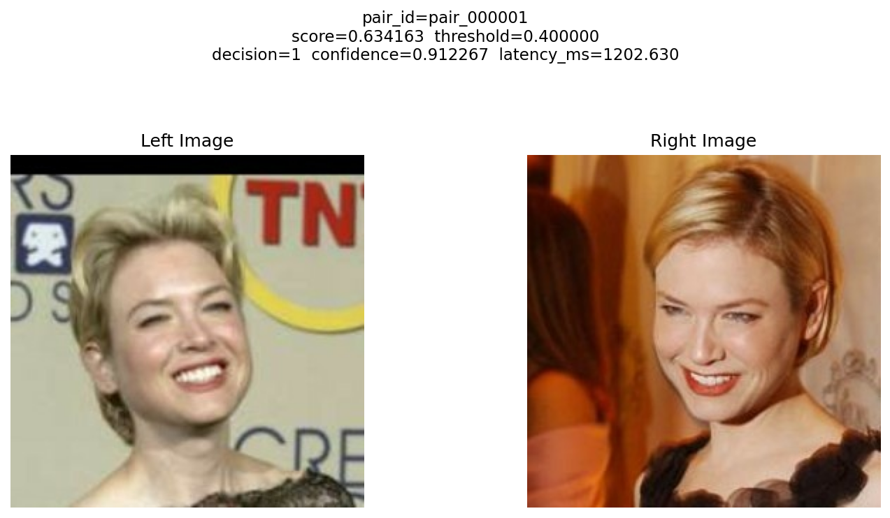

# FaceID_Verification System

End-to-end face verification pipeline. The repo covers deterministic data ingestion, pair generation, tracked evaluation, an embedding-based inference path built around `InceptionResnetV1`, Docker packaging, local load testing, CPU profiling, and final Milestone 4 release documentation.



## What This Repo Produces

The system outputs:

* similarity score
* binary decision
* decision confidence derived from score distance to the operating threshold
* latency for each inference
* tracked run artifacts for evaluation and reproducibility

## Final Release Artifacts

Milestone 4 finalization artifacts are:

* System Card: `reports/System_Card_Milestone4.md`
* Profiling report: `reports/Profiling_Report_Milestone4.md`
* Reproducibility checklist: `reports/Reproducibility_Checklist_Milestone4.md`
* CPU profiling summaries: `reports/evidence/profiling/`
* Final config: `configs/default.yaml`
* CLI entrypoint: `scripts/infer_pair.py`
* Profiling entrypoint: `scripts/profile_inference.py`
* Recommended final tag after commit: `v1.0-final`

## Getting Started

Clone the repository and enter the project directory:

```bash
git clone "https://github.com/princeixr/FaceID_Verification"
cd FaceID_Verification
```

Create the environment and install dependencies.

macOS / Linux:

```bash
python3 -m venv .venv
source .venv/bin/activate
pip install -r requirements.txt
```

Windows (PowerShell):

```powershell
python -m venv .venv
.\.venv\Scripts\Activate.ps1
pip install -r requirements.txt
```

## How to Run

If you want the full project flow, use this order:

1. Start with Milestone 1 to build the baseline data and evaluation pipeline.
2. Run Milestone 2 to compare the baseline with the improved pair-generation setup.
3. Run Milestone 3 to use the explicit embedding inference path, CLI, Docker, and load test.
4. Run Milestone 4 profiling and inspect the final System Card, profiling report, and reproducibility checklist.
5. Inspect generated outputs under `outputs/` for run metadata, thresholds, and summaries.

## Milestones

Milestone 1 established the baseline pipeline: dataset ingestion, pair generation, similarity scoring, tracked evaluation, and the first saved run artifacts.

Milestone 2 extended that baseline with the identity-cap pair-generation variant, threshold selection, and error analysis for comparison.

Milestone 3 turned that pipeline into a deployable inference system: explicit face embeddings with `InceptionResnetV1`, separate inference stages, CLI entrypoint, confidence reporting, Docker packaging, and load testing.

Milestone 4 finalizes the system as a reproducible release: System Card, fairness-risk and limitation discussion, CPU profiling with per-stage latency and batch-size sensitivity, Docker reproduction steps, and final tag guidance.

## Milestone 1

Milestone 1 covers deterministic ingestion, pair generation, baseline similarity scoring, and benchmarking.

Run the Milestone 1 pipeline:

```bash
python3 scripts/ingest_lfw.py
python3 scripts/pair_lfw.py --config configs/default.yaml
python3 scripts/similarity_lfw.py
python3 scripts/benchmark.py
```

Main Milestone 1 artifacts:

* `outputs/manifests/lfw_manifest.json`
* `outputs/manifests/lfw_samples.csv`
* `outputs/pairs/train_pairs.csv`
* `outputs/pairs/val_pairs.csv`
* `outputs/pairs/test_pairs.csv`
* `outputs/similarity_score/train_pairs_scored.csv`
* `outputs/similarity_score/val_pairs_scored.csv`
* `outputs/similarity_score/test_pairs_scored.csv`

## Milestone 2

Milestone 2 adds tracked evaluation, threshold selection, and data-centric comparison.

Threshold-selection policy:

* threshold selection is done on the validation split in sweep mode
* final reporting is read from the held-out test split at the selected threshold
* supported threshold-selection rules are `max_accuracy`, `max_balanced_accuracy`, and `max_f1`

Baseline tracked evaluation:

```bash
python3 scripts/run_eval.py --config configs/default.yaml --mode sweep --selection-rule max_balanced_accuracy --note "baseline-default"
```

Improved identity-cap evaluation:

```bash
python3 scripts/pair_lfw.py --config configs/milestone2_identity_cap.yaml
python3 scripts/similarity_lfw.py
python3 scripts/run_eval.py --config configs/milestone2_identity_cap.yaml --mode sweep --selection-rule max_balanced_accuracy --note "data-centric-improved-identity-cap"
```

Optional error analysis:

```bash
python3 scripts/run_error_analysis.py --run-dir outputs/runs/<run_id> --split test --top-k 20
```

Main Milestone 2 artifacts:

* `outputs/run_summary.csv`
* `outputs/runs/<run_id>/run_info.json`
* `outputs/runs/<run_id>/threshold_metrics.csv`
* `outputs/runs/<run_id>/test_metrics.json`
* `reports/Milestone2_Report.md`

## Milestone 3

Milestone 3 adds embedding-based pair-level inference, persisted threshold usage for inference, automatic inference artifacts, Docker packaging, and local load testing.

### Embedding Model

The default embedding backend is `InceptionResnetV1` from `facenet-pytorch` with pretrained `vggface2` weights.

Notes:

* the main Milestone 3 path uses the pretrained face model
* the older deterministic handcrafted embedding backend remains available for tests and fallback use
* the first local model-backed run may download pretrained weights if they are not already cached
* the Docker image prefetches those weights during build

### Threshold For Inference

Inference uses the selected threshold from evaluation when available. That threshold is persisted at:

* `outputs/inference/selected_threshold.json`

This artifact is generated by `scripts/run_eval.py` after threshold sweep completes on the validation split. In sweep mode, `run_eval.py`:

* computes similarity scores for the configured embedding system
* evaluates a grid of candidate thresholds on `val`
* selects the best threshold using the requested rule such as `max_f1`
* writes the selected threshold to `outputs/inference/selected_threshold.json`

A typical threshold artifact looks like:

```json
{
  "run_id": "run_20260419T004952Z_a7f2c22b",
  "selection_rule": "max_f1",
  "selection_split": "val",
  "source_run_dir": "outputs/runs/run_20260419T004952Z_a7f2c22b",
  "source_run_info": "outputs/runs/run_20260419T004952Z_a7f2c22b/run_info.json",
  "threshold": 0.4
}
```

Field meaning:

* `threshold` - the operating threshold used by inference when no explicit `--threshold` override is passed
* `selection_rule` - the rule used to choose the threshold, such as `max_f1`
* `selection_split` - the split used for threshold selection; this should be `val`, not `test`
* `run_id` - the tracked evaluation run that produced the threshold
* `source_run_dir` and `source_run_info` - links back to the tracked evaluation artifacts

Threshold precedence during inference:

1. explicit `--threshold`
2. persisted `outputs/inference/selected_threshold.json`
3. fallback config default from `configs/default.yaml`

### Inference CLI

Single-pair inference:

```bash
python3 scripts/infer_pair.py \
  --config configs/default.yaml \
  --left-path data/lfw/images/Barbara_Walters/004492.jpg \
  --right-path data/lfw/images/Barbara_Walters/007353.jpg \
  --output-format json
```

Batch inference from a pair CSV:

```bash
python3 scripts/infer_pair.py \
  --config configs/default.yaml \
  --pairs-csv outputs/pairs/test_pairs.csv \
  --output-format json
```

Limit batch inference to the first `N` rows:

```bash
python3 scripts/infer_pair.py \
  --config configs/default.yaml \
  --pairs-csv outputs/pairs/test_pairs.csv \
  --max-pairs 25 \
  --output-format json
```

Request explicit extra output copies:

```bash
python3 scripts/infer_pair.py \
  --config configs/default.yaml \
  --left-path data/lfw/images/Barbara_Walters/004492.jpg \
  --right-path data/lfw/images/Barbara_Walters/007353.jpg \
  --output-format json \
  --output-json outputs/cli_test_infer_pair.json \
  --output-plot outputs/cli_test_infer_pair.png
```

The inference output includes:

* `similarity_score`
* `threshold`
* `decision`
* `confidence`
* `latency_ms`
* `stage_latency_ms`

### Inference Artifacts

Every inference invocation writes artifacts automatically under `outputs/inference/`.

Single-pair runs create:

* `outputs/inference/infer_single_<timestamp>/`

Batch runs create:

* `outputs/inference/infer_batch_<timestamp>/`

Each artifact folder contains:

* `results.json` - full result payload for the run
* `run_info.json` - run metadata, including pair count and threshold override if used
* `pairs/<pair_id>.json` - one JSON result per processed pair
* `plots/<pair_id>.png` - one side-by-side comparison plot per processed pair

Optional explicit output paths still work when you want an extra copy in a specific location:

```bash
python3 scripts/infer_pair.py --config configs/default.yaml --left-path data/lfw/images/Barbara_Walters/004492.jpg --right-path data/lfw/images/Barbara_Walters/007353.jpg --output-format json --output-json outputs/cli_test_infer_pair.json --output-plot outputs/cli_test_infer_pair.png
```

The CLI prints:

* pair identifier and input paths
* similarity score
* threshold
* binary decision
* decision confidence
* total latency
* per-stage latency breakdown for preprocessing, embedding, scoring, thresholding, and confidence

### Confidence

Confidence uses a deterministic logistic-margin rule. The stored confidence is threshold-margin support for the same-identity decision under the configured score direction, not an independent class probability. With the default setting where higher scores mean same identity, values above `0.5` support `decision=1`, values below `0.5` support `decision=0`, and values near `0.5` are close to the operating threshold.

* `margin = similarity_score - threshold` when higher scores mean same identity
* `margin = threshold - similarity_score` when lower scores mean same identity
* `confidence = 1 / (1 + exp(-sharpness * margin))`
* default `sharpness = 10.0`

Range and interpretation:

* range: `(0, 1)`
* around `0.5`: the score is near the decision boundary, so the system has weak support for the current decision
* near `1.0`: the score is farther above the threshold, so the system has stronger support for a same-identity decision
* this value should be read as threshold-margin support, not as a calibrated posterior probability of identity match

### Threshold

The current final operating threshold is selected on validation with the same sweep discipline used in Milestone 2 and Milestone 3.

* selected threshold: `0.40`
* selection rule: `max_f1`
* selection split: `val`
* persisted for inference in: `outputs/inference/selected_threshold.json`
* fallback config default in: `configs/default.yaml`
* recorded from the tracked validation sweep in: `outputs/runs/run_20260419T004952Z_a7f2c22b/run_info.json`

Final validation metrics at threshold `0.40`: accuracy `0.9780`, balanced accuracy `0.9780`, precision `0.9825`, recall `0.9733`, and F1 `0.9779`.

Final held-out test metrics at threshold `0.40`: accuracy `0.9770`, balanced accuracy `0.9770`, precision `0.9773`, recall `0.9767`, and F1 `0.9770`.

### Docker

Build the container image for the CLI:

```bash
docker build -t faceid-verification:v1.0-final .
```

Smoke-test the container entrypoint:

```bash
docker run --rm faceid-verification:v1.0-final --help
```

Run single-pair inference inside Docker. Because the image does not bundle your local `data/` and `outputs/` directories, mount the repo into `/app`:

```bash
docker run --rm -v ${PWD}:/app -w /app faceid-verification:v1.0-final --config configs/default.yaml --left-path data/lfw/images/Barbara_Walters/004492.jpg --right-path data/lfw/images/Barbara_Walters/007353.jpg --output-format json
```

Run batch CSV inference inside Docker:

```bash
docker run --rm -v ${PWD}:/app -w /app faceid-verification:v1.0-final --config configs/default.yaml --pairs-csv outputs/pairs/test_pairs.csv --output-format json
```

The image excludes `data/` and `outputs/` through `.dockerignore`, so mount the working directory when you run inference in the container.

### Load Test

Run the local load test:

```bash
python3 scripts/load_test.py \
  --config configs/default.yaml \
  --pairs-csv outputs/pairs/test_pairs.csv \
  --workers 2 \
  --repeat 1 \
  --output-json outputs/load_test_summary.json
```

The load-test summary includes:

* total requests processed
* successful requests
* failed requests
* total wall-clock time
* throughput in requests/sec
* latency distribution, including p95
* per-request records with latency or error text

### Milestone 3 Artifacts

* `outputs/inference/infer_single_<timestamp>/` or `outputs/inference/infer_batch_<timestamp>/` (including `results.json`, per-pair `pairs/<pair_id>.json`, and `plots/<pair_id>.png` for batch runs)
* Optional explicit CLI copy: `outputs/cli_test_infer_pair.json`
* `outputs/inference/selected_threshold.json`
* `outputs/load_test_summary.json`
* `outputs/runs/<run_id>/run_info.json`
* `outputs/runs/<run_id>/threshold_metrics.csv`

## Tests

Run the main test suite from the repo root:

```bash
python3 -m pytest tests/test_embedding.py tests/test_inference.py tests/test_infer_pair_cli.py tests/test_thresholding.py tests/test_metrics.py tests/test_tracking.py tests/test_validation.py tests/test_integration_eval_pipeline.py
```

## Milestone 4 Finalization

Milestone 4 is the final audit, profiling, and release pass for the embedding-based verifier. The final documents are meant to be read together:

* `reports/System_Card_Milestone4.md` describes intended use, out-of-scope uses, data limitations, operating threshold, metrics, failure modes, fairness-related risks, and operational constraints.
* `reports/Profiling_Report_Milestone4.md` reports the required CPU baseline, preprocessing vs embedding vs scoring latency, and batch-size sensitivity.
* `reports/Reproducibility_Checklist_Milestone4.md` gives the shortest exact command path for a clean-clone reproduction and final tag.

Run CPU profiling:

```bash
python3 scripts/profile_inference.py --config configs/default.yaml --pairs-csv outputs/pairs/test_pairs.csv --repeats 3 --warmup 1 --batch-sizes 1,2,4 --output-dir reports/evidence/profiling
```

Profiling outputs:

* `reports/evidence/profiling/profile_summary.json`
* `reports/evidence/profiling/single_pair_stage_records.csv`
* `reports/evidence/profiling/batch_size_sensitivity.csv`

Current CPU baseline summary from this workspace:

* preprocessing mean latency: `1.055 ms`
* embedding-generation mean latency: `43.204 ms`
* combined scoring mean latency: `0.027 ms`
* end-to-end mean latency: `44.287 ms`
* batch-size sensitivity: `23.648`, `22.861`, and `21.922` pairs/sec for sequential batch sizes `1`, `2`, and `4`

## Quick Reproducibility Checklist

Use this command sequence from a clean workspace to reproduce the final Milestone 4 flow from scratch. The detailed checklist is in `reports/Reproducibility_Checklist_Milestone4.md`.

```bash
git clone "https://github.com/princeixr/FaceID_Verification"
cd FaceID_Verification

rm -rf outputs data/lfw

python3 -m venv .venv
source .venv/bin/activate
pip install -r requirements.txt

python3 scripts/ingest_lfw.py
python3 scripts/pair_lfw.py --config configs/default.yaml
python3 scripts/run_eval.py --config configs/default.yaml --mode sweep --selection-rule max_f1 --note "milestone3-embedding-threshold"

cat outputs/inference/selected_threshold.json

python3 scripts/infer_pair.py --config configs/default.yaml --left-path data/lfw/images/Barbara_Walters/004492.jpg --right-path data/lfw/images/Barbara_Walters/007353.jpg --output-format json
python3 scripts/infer_pair.py --config configs/default.yaml --pairs-csv outputs/pairs/test_pairs.csv --max-pairs 25 --output-format json
python3 scripts/load_test.py --config configs/default.yaml --pairs-csv outputs/pairs/test_pairs.csv --workers 2 --repeat 1 --output-json outputs/load_test_summary.json
python3 scripts/profile_inference.py --config configs/default.yaml --pairs-csv outputs/pairs/test_pairs.csv --repeats 3 --warmup 1 --batch-sizes 1,2,4 --output-dir reports/evidence/profiling
python3 -m pytest tests/test_embedding.py tests/test_inference.py tests/test_infer_pair_cli.py tests/test_thresholding.py tests/test_metrics.py tests/test_tracking.py tests/test_validation.py tests/test_integration_eval_pipeline.py

docker build -t faceid-verification:v1.0-final .
docker run --rm faceid-verification:v1.0-final --help
docker run --rm -v "${PWD}:/app" -w /app faceid-verification:v1.0-final --config configs/default.yaml --left-path data/lfw/images/Barbara_Walters/004492.jpg --right-path data/lfw/images/Barbara_Walters/007353.jpg --output-format json
```

Artifacts:

* `outputs/inference/infer_single_<timestamp>/results.json` - full single-pair inference result
* `outputs/inference/infer_batch_<timestamp>/results.json` - full batch inference result
* `outputs/inference/infer_batch_<timestamp>/pairs/<pair_id>.json` - per-pair batch results
* `outputs/inference/infer_batch_<timestamp>/plots/<pair_id>.png` - per-pair comparison plots
* `outputs/load_test_summary.json` - load-test summary and latency distribution
* `outputs/inference/selected_threshold.json` - persisted threshold used by inference
* `outputs/run_summary.csv` - tracked evaluation history
* `outputs/runs/<run_id>/run_info.json` - run metadata, including selected threshold
* `outputs/runs/<run_id>/threshold_metrics.csv` - validation sweep summary
* `reports/evidence/profiling/profile_summary.json` - CPU profiling summary

## Repo Layout

* `src/` - core logic for config, embedding, inference, evaluation, thresholding, and tracking
* `scripts/` - runnable entrypoints for ingestion, pair generation, evaluation, CLI inference, and load test
* `reports/` - milestone reports, final System Card, profiling report, reproducibility checklist, and lightweight evidence
* `configs/` - YAML configuration files
* `outputs/` - generated artifacts
* `data/` - downloaded LFW images
* `Dockerfile` - container entrypoint for the CLI

## Notes

* the default embedding stage now uses pretrained `InceptionResnetV1` face embeddings
* the deterministic handcrafted backend remains available for tests and fallback use
* the Milestone 3 inference path is split into preprocessing, embedding generation, similarity scoring, threshold decision, confidence computation, and latency measurement
* Milestone 2 and Milestone 3 artifacts are preserved so the repo still supports tracked evaluation and comparison
