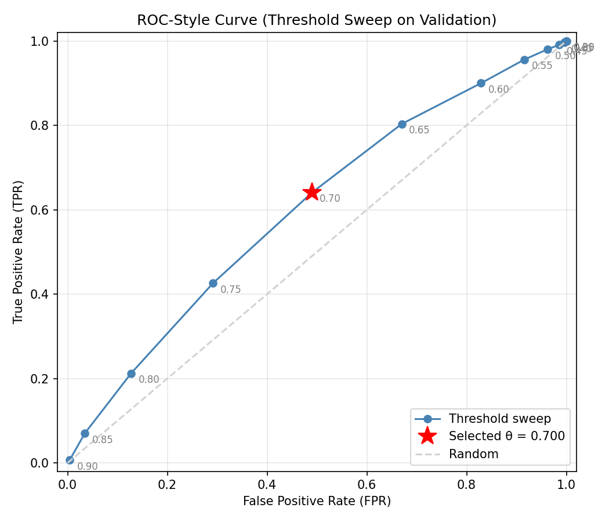
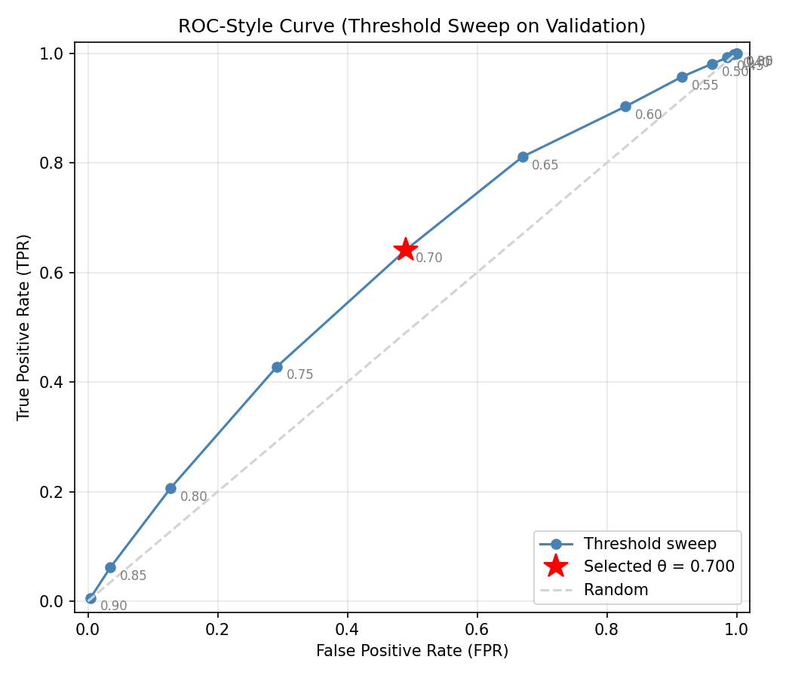
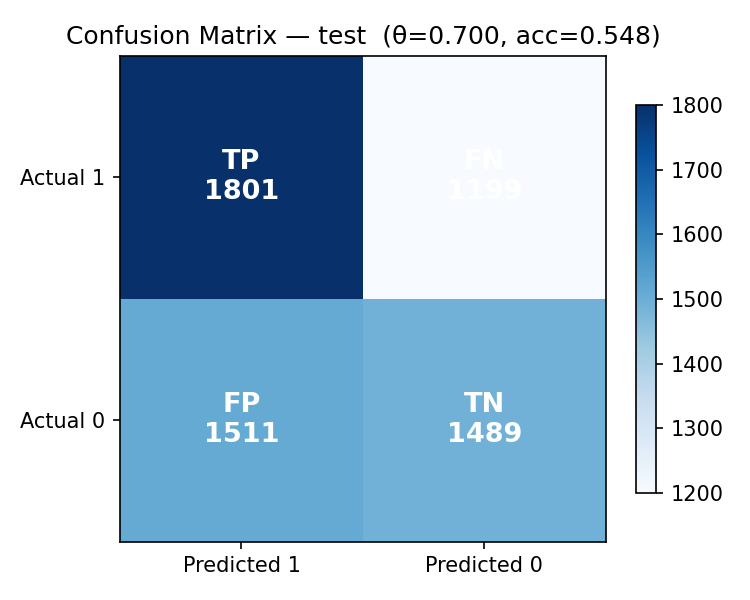

# MSML 605 Milestone 2 Report

## 1. Scope

This is the Milestone 2 evaluation report for the face verification pipeline. It documents the baseline system, the threshold-selection process on validation data, the data-centric iteration (identity participation cap), and the resulting error behavior on the held-out test split.

## 2. Reproduction Commands (Copy-Paste)

### 2.1 Environment

```bash
python -m venv .venv
.venv\Scripts\Activate.ps1
pip install -r requirements.txt
```

### 2.2 Baseline Pipeline

```bash
python scripts/ingest_lfw.py
python scripts/pair_lfw.py --config configs/default.yaml
python scripts/similarity_lfw.py
python scripts/run_eval.py --config configs/default.yaml --mode sweep --selection-rule max_balanced_accuracy --note "baseline-default"
python scripts/run_error_analysis.py --run-dir outputs/runs/<baseline_run_id> --split test --top-k 20
```

### 2.3 Data-Centric Improved Pipeline

```bash
python scripts/pair_lfw.py --config configs/milestone2_identity_cap.yaml
python scripts/similarity_lfw.py
python scripts/run_eval.py --config configs/milestone2_identity_cap.yaml --mode sweep --selection-rule max_balanced_accuracy --note "data-centric-improved-identity-cap"
python scripts/run_error_analysis.py --run-dir outputs/runs/<improved_run_id> --split test --top-k 20
```

Use the run_id printed by `run_eval.py` for `<baseline_run_id>` and `<improved_run_id>`.

### 2.4 Tests

```bash
python -m pytest -q tests
python -m pytest -q tests/test_integration_eval_pipeline.py
```

Unit test coverage includes:

- metrics (tests/test_metrics.py)
- thresholding logic (tests/test_thresholding.py)
- validation checks (tests/test_validation.py)
- run tracking helpers (tests/test_tracking.py)

Integration test:

- tests/test_integration_eval_pipeline.py

## 3. What Was Implemented

### 3.1 Baseline and Threshold Selection

The baseline run used the default configuration and selected threshold via a validation-split sweep using the balanced-accuracy rule.

Split roles used in this milestone workflow:

- threshold selection split: validation
- final reporting split: test

Score direction used in this project:

- higher similarity score means more likely same-person

- baseline run id: run_20260326T222634Z_fea08c15
- baseline config: configs/default.yaml
- threshold rule used: max_balanced_accuracy

Threshold selection is configurable per run through:

- scripts/run_eval.py (`--selection-rule`)
- src/thresholding.py (max_accuracy, max_balanced_accuracy, max_f1)

### 3.2 Tracked Runs and Provenance

Each evaluation run writes tracked artifacts including:

- outputs/run_summary.csv
- outputs/runs/<run_id>/run_info.json
- outputs/runs/<run_id>/config_used.yaml
- outputs/runs/<run_id>/threshold_metrics.json
- outputs/runs/<run_id>/threshold_metrics.csv
- outputs/runs/<run_id>/train_metrics.json
- outputs/runs/<run_id>/test_metrics.json
- outputs/runs/<run_id>/val_metrics.json
- outputs/runs/<run_id>/plots/*

Evidence of tracked runs (at least 5) is available in:

- outputs/run_summary.csv

Representative run IDs present in run_summary.csv:

- run_20260326T203408Z_33b8f1c6
- run_20260326T203533Z_1f30a81a
- run_20260326T203655Z_666b1de4
- run_20260326T222634Z_fea08c15
- run_20260326T222848Z_f0a671d7

### 3.3 Evaluation Modes

The evaluation runner supports both:

- threshold sweep mode (`--mode sweep`)
- fixed threshold mode (`--mode fixed --fixed-threshold <value>`)

### 3.4 Validation Checks

The pipeline validates:

- pair schema and required columns
- binary labels and split values
- referenced image paths
- threshold config range/increment/default
- score count vs pair count
- split integrity leakage

Implementation is in src/validation.py and is called from scripts/run_eval.py.

### 3.5 Tests

Tests included in this milestone:

- unit tests:
  - tests/test_metrics.py
  - tests/test_thresholding.py
  - tests/test_validation.py
  - tests/test_tracking.py
- integration test:
  - tests/test_integration_eval_pipeline.py

### 3.6 Data-Centric Improvement

The implemented data-centric change is identity participation capping during pair generation.

- config switches:
  - pairs.identity_cap_enabled
  - pairs.max_pairs_per_identity
- improved config used: configs/milestone2_identity_cap.yaml

Related implementation and artifacts:

- src/pairing.py
- scripts/pair_lfw.py
- outputs/pairs/pair_policy.json

### 3.7 Error Slice Analysis

Error analysis generates two required slices:

- false positives
- false negatives

Artifacts are produced per run under:

- outputs/runs/<run_id>/error_analysis/test_error_slices_summary.json
- outputs/runs/<run_id>/error_analysis/test_false_positives.csv
- outputs/runs/<run_id>/error_analysis/test_false_negatives.csv

Runs analyzed in this report:

- outputs/runs/run_20260326T222634Z_fea08c15/error_analysis/test_error_slices_summary.json
- outputs/runs/run_20260326T222848Z_f0a671d7/error_analysis/test_error_slices_summary.json

### 3.8 Baseline vs Improved Comparison Artifact

Comparison artifacts:

- reports/evidence/comparisons/baseline_vs_identity_cap.json
- reports/evidence/comparisons/baseline_vs_identity_cap.csv

Required plot artifacts referenced in this report:

- baseline ROC-style plot: reports/evidence/figures/baseline_roc_curve.png
- baseline confusion matrix at selected threshold (test): reports/evidence/figures/baseline_confusion_matrix_test.png
- improved ROC-style plot: reports/evidence/figures/improved_roc_curve.png
- improved confusion matrix at selected threshold (test): reports/evidence/figures/improved_confusion_matrix_test.png

All files below are submission-visible copies stored under reports/evidence/ so they can be reviewed directly from this report.

Embedded key figures:

Baseline ROC-style threshold sweep:




Baseline confusion matrix at selected threshold (test, theta=0.70):


Improved ROC-style threshold sweep:



Improved confusion matrix at selected threshold (test, theta=0.70):



## 4. Quantitative Summary (Baseline -> Improved)

- Selected threshold: 0.70 -> 0.70
- Test accuracy: 0.5640 -> 0.5483 (delta -0.0157)
- Val accuracy: 0.5753 -> 0.5708 (delta -0.0046)
- False positives rate (test): 0.2518 -> 0.2518 (delta +0.0000)
- False negatives rate (test): 0.1842 -> 0.1998 (delta +0.0157)

Interpretation:

- The improved policy with identity capping did not lower false positives at the current selected threshold.
- In this run pair, test and validation accuracy decreased slightly, while false negatives increased.
- This indicates the current cap setting likely needs another iteration (for example, cap value tuning and/or threshold rule constraints).

## 5. Required Narrative Elements

### 5.1 Threshold-Selection Rule (Concise)

- Rule used: maximize balanced accuracy on sweep results.

### 5.2 Before-vs-After Data-Centric Summary

- Before: no identity cap in pair participation.
- After: enabled identity cap (max_pairs_per_identity=120).

### 5.3 Two Error Slices + Hypotheses

- False positives hypothesis:
  - slice definition: different-identity pairs predicted as same (label=0, predicted=1).
  - slice size (baseline test): 1511 / 6000 (25.18%).
  - different identities with similar pose/lighting are scored too high.
  - representative examples (baseline run):
    - data/lfw/images/Stanley_Tong/009245.jpg vs data/lfw/images/Tom_Curley/013148.jpg (score 0.9176, predicted same)
    - data/lfw/images/Sergio_Castellitto/012182.jpg vs data/lfw/images/Fernando_Leon_de_Aranoa/006788.jpg (score 0.9102, predicted same)
  - future improvement note:
    - tighten false-accept control by selecting a threshold under an explicit FPR constraint.
- False negatives hypothesis:
  - slice definition: same-identity pairs predicted as different (label=1, predicted=0).
  - slice size (baseline test): 1105 / 6000 (18.42%).
  - same-identity pairs with blur/occlusion/pose gap are scored too low.
  - representative examples (baseline run):
    - Colin_Powell/005138.jpg vs Colin_Powell/008948.jpg (score 0.4036, predicted different)
    - Abid_Hamid_Mahmud_Al-Tikriti/006270.jpg vs Abid_Hamid_Mahmud_Al-Tikriti/012582.jpg (score 0.4310, predicted different)
  - future improvement note:
    - add deterministic quality filtering and quality-aware pair balancing for hard same-identity cases.

### 5.4 Iteration Lesson

- Data balancing changes operating behavior, not just scalar accuracy.
- The preferred variant depends on whether the use case prioritizes false-accept control or false-reject control.

